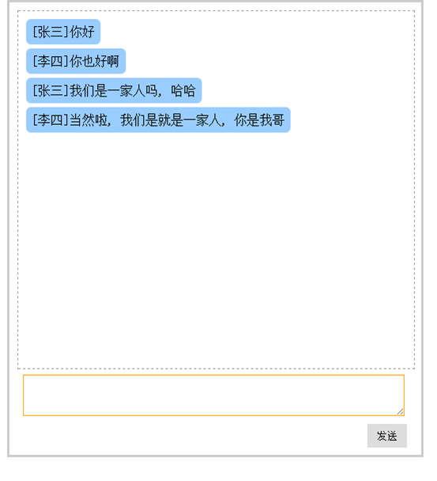

# 大纲 #

1. 瀑布流
2. 聊天室
3. 跨域

# 瀑布流 #

接口： 
http://localhost:8080/ajax/pbl

点击 “加载图片”，自动加载图片

# 聊天室 #

使用Ajax实现聊天
实现聊天功能, 显示效果图如下: 
1, 在输入框中输入内容后, 点击发送按钮可以发送出去;
2, 可以定时从服务器获取数据;

发送数据的URL: 
	http://自己服务器IP:8080/ajax/chat, 
	参数: type=send
         sender=发送者填入的用户名
         msg=发送者的发送消息

获取数据的URL: 
	http://自己服务器IP:8080/ajax/chat,
	参数: type=query
	
# 跨域 #

js 具有同源策略
 必须是【同源】的网页，才可以请求自己服务器的数据
【同源】: 协议、域名(IP)、端口 三者一致才是同源
    http://www.baidu.com    http://www.google.com   不同源
    http://www.baidu.com/xinwen    http://www.baidu.com/ditu   同源

## 跨域的解决办法
1. img
2. script
3. iframe
4. jsonp

## JSONP

JSONP不是Ajax，没有利用XMLHttpRequest对象，而是利用script标签请求一个外部的网址，那个网址的内容是一个函数的执行，比如fun(JSON)。所以叫做JSONP，就是JSON + padding。此时页面中要定义一个函数，就相当于数据通过实参传给形参进入页面。我们可以瞬间创建一个script标签，然后立即删除它来发出JSONP请求，jQuery中的JSONP原理就是这样。

案例：
点击“获取数据”按钮，获取气象局中最新的天气数据

# 作业

重写所有案例

