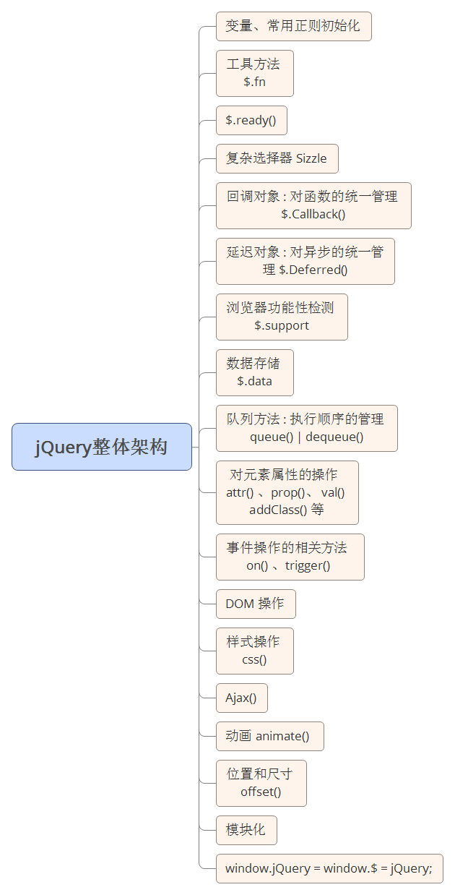

详细资料参考当前目录 “JQuery第1天课堂笔记.docx”

# 大纲 #

1. JQuery简介
2. JQuery常用方法
3. JQuery中的插件

# JQuery简介 #

JQuery 的发展历史
http://blog.csdn.net/zuoninger/article/details/18594241

John Resig   jQuery的第一创始人





# JQuery常用方法

## 选择器

```
$("#id")
$(".class")
$("p")
$("*")

```
其他参见我们的文档 jQuery1.8.3_20121215.chm


整个页面加载完成
```
document.onload = 函数

// 只是加载DOM结构
$(document).ready(函数)
$(函数)   【重点】

// 所有资源都加载完毕
$(window).ready(函数)

```

## 元素CSS属性获取
CSS
1. 元素尺寸
2. 元素位置
3. 

```
// 获取
$("#div1").css("width")    【重点】

// 设置
$("#div1").css("width", 200)
$("#div1").css("width", "200px")
$("#div1").css({"width": 200})     【重点】
```

## 动画方法
1. animate

```
$("p").animate(JS对象, 动画时间, 回调函数/动画类型)
```


# JQuery中的插件 #

1. 滚轮事件
2. 轮播图


# 作业
把所有案例都敲1遍
1. 整理jQuery的笔记，发到简书。
2. 研究下 position() 方法怎么用，把你的想法和例子，发到简书。