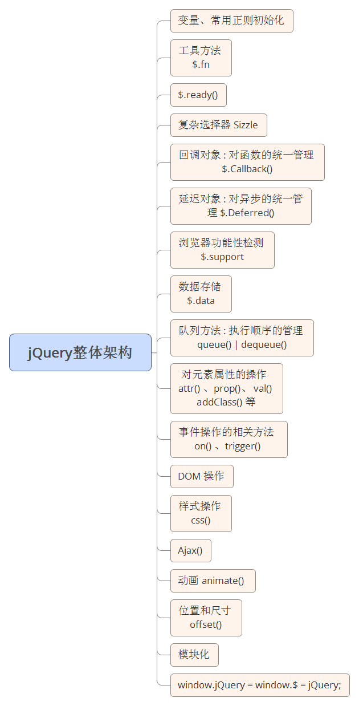

详细资料参考当前目录 “JQuery第1天课堂笔记.docx”

# 大纲 #

1. JQuery简介
2. JQuery常用方法
3. JQuery中的插件

# JQuery简介 #

JQuery 的发展历史
http://blog.csdn.net/zuoninger/article/details/18594241

John Resig   jQuery的第一创始人

# JQuery常用方法

## 选择器

## 元素CSS属性获取
CSS
1. 元素尺寸
2. 元素位置
3. 

## 动画方法
1. animate

# JQuery中的插件 #

1. 滚轮事件
2. 轮播图
3. 

