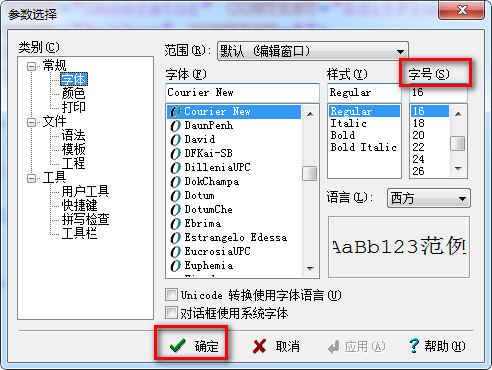
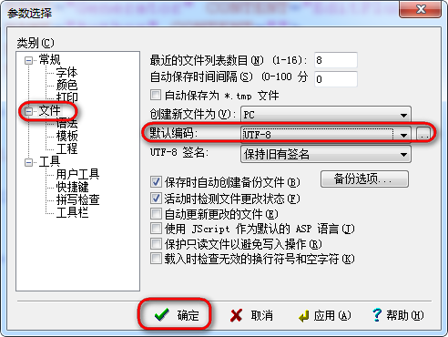
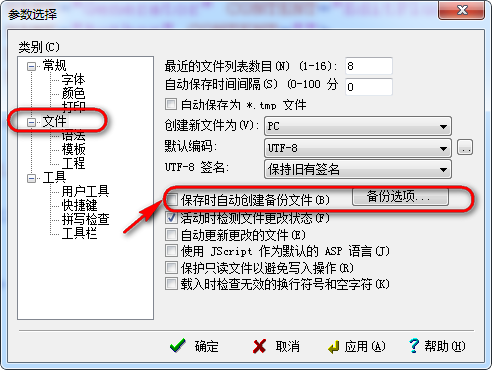

# 大纲 #
1. JS是什么
2. 变量
3. 基本运算

# 课程内容 #

## JS是什么 ##

### 为什么要学? ###

1. 动态效果的基石
2. 游戏
3. 地图
4. Web聊天
5. ...

### 历史 ###
Netscape 与 IE

1995 全球 有1个大公司（网景 NetScape） 浏览器
（全球第一个做浏览器的）

99% 全部用的网景的浏览器，浏览器是收费的！
1个程序员： 发现了1个问题：
	银行 -> 注册账号（姓名、身份证号、地址、邮编） 提交按钮

	上网采用的  电话线上网，网速慢得像蜗牛

	30分钟 服务器发现 身份证号少了1位
	30分钟   发了信息给注册的人，尊敬的客户您好，您的身份证号有误，请重新输入

编程语言： LiveScript, 在浏览器中执行的程序

当时世界流行的语言： Java，C，汇编等

==> JavaScript

如日中天，非常牛逼，就像现在的 阿里巴巴，腾讯 

微软  操作系统 bill

1996年 IE1.0   非常多的bug， 不战而败     网景
1997年 IE2.0   bug还是有些
1998年 IE3.0   还是打不过                 
1999年 IE4.0  捆绑销售（你买我的操作系统，免费送IE浏览器）

	1年，网景倒闭了，CEO -> 公开网景浏览器的源代码 -> firefox

1999~2008 十年的时间   微软IE的天下

	Firefox 促进 Chrome -> 移动互联网时代

与 JScript
98开始， 需要定义一个标准

ECMA 欧洲计算机组织协会，由他制定JavaScript标准

2015  ECMAScript 2015 javascript 的标准

ES5  现在主要
ES6

### 特点 ###

JavaScript 编程语言

1. 解释型语言
编程语言分类： 
    (1) 编译型 ： 需要编译， C, Java, ...， 运行效率高
    (2) 解释型： 不需要编译, python,perl,php, 运行效率低

2. 宿主为浏览器
JavaScript 必须在浏览器上运行

开发环境：

	HBuilder，WebStorm, notepad++ ，等等 非常多的编辑器

	只要你写的程序【对了】，在有载体的情况下：就可以正常运行
		对：1， 不对：2
		
	
	在正常环境下，【代码】对，逻辑对，兼容对，代码就可以正常运行！
		没问题的！

我有说用什么编辑器吗？和你的编辑器有关吗？   没有！！！

入门： Editplus 编辑器
	1. 没有提示 ==> 更利于打基础
	2. 也有颜色区分 ==> 方便大家阅读
	3. 比较小巧

### 组成部分 ###

通常所说 JavaScript 包含下面三个部分

1. ECMAScript
    只规定了程序的格式、语法等
2. DOM (重要)
    体现了JavaScript面向对象的编程思想
	通过 JS 可以操作（增、删、修、查）网页上的元素 
3. BOM
    通过BOM可以进行浏览器操作

### 如何写 ###
---------

Editplus 安装

1. 破解

2. 新建 HTML 文件

3. 字体大小设置
    工具 / 参数设置

4. 默认的文件编码设置
    工具 / 参数选择 / 默认编码

5. 取消文件默认选项

---------

【示例】 第一个js程序

### 语法 ###

1. 引入方式

    (1) 嵌入式：
    `<head>  </head>`
	
	(2) 引入式：
     ``
     注意要写在 head 标签中

2. 输出内容
	document.write

3. 注释
    单行注释 `//`
	多行注释 `/* */`

4. script的属性
    type  "text/javascript", 浏览器基本上也不管，所以可以省略
    language 浏览器基本都不识别，所以可以不写

## 变量 ##

来做一个简单的计算，那么必须要知道数据是如何存储的

### 标识(zhi)符 ###

由 字母(a-z, A-Z)、数字、下划线、$ 组成的式子，称为标识符。 
必须是以字母、下划线、$ 开头， 不能以数字开头

示例:

abc 是的
a_123 是的
长度 不是
___ 是的
$len 是
2x 不是

1. 组成方式
    字母、数字、下划线、$ 
    不能以数字开头

2. 建议
    (1) 不能重名
	(2) 名字尽可能有意义
	(3) 单词之间首字母尽量大写  datalength -> dataLength

### 什么是变量 ###

【示例】 定义变量

var a = 10;

### 变量的类型 ###

为了更好的管理计算机的内存，所以引入了变量类型的概念。

### 类型转换 ###

分类： number, string, boolean

(1) 字符串转数字
parseInt("123")

(2) 数字转字符串
直接赋值

var a = 10;
"" + a

## 基本运算 ##

【案例演示】 简易计算器

### 表达式 ###

用 运算符(+, -...) 将变量 和 常量连接起来的式子，称为表达式。

例如：
5 + 5

### 算数运算 ###

算数运算符： +, -, *, /, %

【练习】 做一个计算两数相乘的计算器

1. input 中 id 用于取出 input 中的值
2. onclick 中的名字要 (), 并且与 js 中的名字保持一致
3. document.write 是会清空body元素中原有内容的
4. 如果发现bug，不要慌张， 加上一个 输出 语句， 缩小范围，直到找到 bug，并解决
5. 写出来后，记得测试3遍

两个运算符，++(自增运算符)，-- （自减运算符）
见（demo7-自增自减.html）

【练习】

已知 var a = 9;     (赋值运算符,  自增, 自减运算符)
    var b = a++;
    var c = --b;

输出 a? b? c?

见(demo8-自增自减练习.html)

### (扩展) 位运算 ###

# 作业 #
1. 今天课堂所有的例子代码，照敲两遍

2. 为抵抗洪水，战士连续作战89小时，编程计算共多少天零多少小时？

3. 小明要到美国旅游，可是那里的温度是以华氏度为单位记录的。它需要一个程序将华氏温度（80度）转换为摄氏度，并以华氏度和摄氏度为单位分别显示该温度。
 ：摄氏度与华氏度的转换公式为：摄氏度 = 5/9.0*(华氏度-32)
 保留3位小数

4. k=-2;
document.write(++k + k++ + ++k + k);

5. 【选做，要用到后天的内容】入职薪水10K，每年涨幅5%，50年后工资多少？(预习for)

