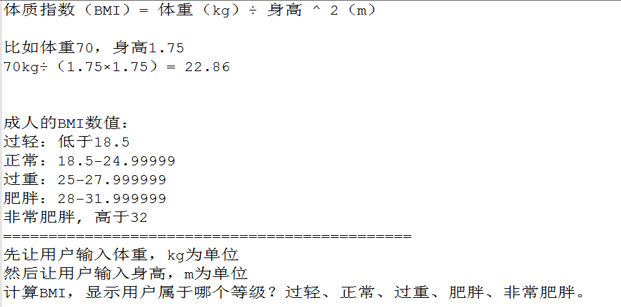

# 大纲 #
1. 循环语句 while
2. 循环语句 for 
3. 嵌套、调试

# 课程内容 #

## 测验 ##




## 补充  ##

---------
复合运算符

```
+=
-=
*=
/=
%=
```

---------
逗号运算符
,

// 逗号表达式
// 功能： 从左到右依次执行每个表达式
// 值： 是最后一个表达式的值

---------
switch
```

语法：
switch (表达式) {
case 匹配值1:
    语句1
    语句2
	// 【注意】break 是代表终止 switch 的运行
    break;

case 匹配值2:
    语句1
    语句2
    break;

default:
    只有上面所有 case 都没匹配到的时候，就执行这里
    语句;
    break;
}


```


【案例】输入数字，输出星期几


【练习】 计算 2016-07-13 是今年的第几天。

2月份: 28天


## while ##

【案例】
输出以下图形：

```
**********
```

程序的三大结构
(1) 顺序结构： 从上往下执行
(2) 选择结构
(3) 循环结构： 重复执行某段代码


【练习】在页面上输出 1，2，3， 。。。 100


【案例】 打印100以内7的倍数

a % 7 == 0

思路：
7， 14， 21
下一个7的倍数 = 上一个7的倍数 + 7


【练习】 打印100以内的奇数


【案例】 打印100以内所有偶数的和


【练习】 求出 1+2+3 + .. + 100 的和


### break 和 continue ###

break 终止： switch, while

continue: 跳过当前循环中以下的所有代码


【练习】
小明本周上5天班，每天做同样的工作：
输出"hello world"，
但是星期二小明不想上班，请假一天；(continue)

小明本周上5天班，每天做同样的工作：
输出"hello world"，
但是星期4的早上，小明收到消息中了500W，
他就直接提出了辞职，没有上班了。（break）


---------

debug: 找出bug的过程：

1. 暴力调试
2. 在线调试


---------
【案例】

```
**********
**********
**********
**********
```


## for循环 ##


固定次数： 起始值， 终止值， 增量 
            1      100    1   ==> 循环100次
            1      100    2   ==> 循环50次
            1      5      1   ==> 循环5次


语法：
for (var i = 起始值; i <= 终止值; i++ ) {
    循环的内容
}


【练习】 输出1，2， 。。。100 的数字 (使用for)


计算1+3+5+...+99的和


一个新入职，月工资为2000元的员工，每年涨工资5%，到退休时的月工资是多少？（年龄22-60）

打印100�C200之间所有能被3或者7整除的数  8K
计算100的阶乘  9K

### 打印图形 ###

【案例】

```
**********
```


---------
【案例】

```
**********
**********
**********
**********
```


```
*
**　
***
****
*****
```

【练习】打印10行的斜三角形
(demo11-打印图形.html)


 行号   星星数目
 1       1
 2       2
 3       3
 
 
 
 星星数目 == 行号 (规律是对的)
 5        5


```
    *
   **
  ***
 ****
*****
```
【练习】 打印10行的斜三角形


   行号  星星数  空格数
   1      1      4
   2      2      3
   3      3      2
   
   
   空格数 与 行号的关系 
   
   空格数 =  5-行号


```
*
***
*****
***
*
```


【案例】(难)输出100-200之间所有的素数  15K

素数, 也称为质数： 只能被1与自身整除的数字。

如果2~n-1 之间有一个数能整除n，那么n就不是质数


## do-while循环 ##

// 先执行循环体， 再判断条件
do {
	document.write(i + ", ");
	i++;
} while (i <= 5);


do-while 不管条件如何，总会执行第一次。

语法：

do {
    循环语句(if, while,for, do-while)
} while( 表达式 );


## 练习+扩展 ##
99乘法表

求1+2!+3!+...+20!的值


求100-999之间的水仙花数。abc =a^3+b^3+c^3
求s=a+aa+aaa+aaaa+….+aa...a的值，其中a是一个数字。例如2+22+222+2222


### DEBUG ###
打印 100 到 1
设置断点
单步


# 作业 #

第1题 难度★

在控制台输出1~1000之中，所有能被5整除，或者被6整除的数字。

---------

第2题 难度★ 

```
用户输入一个数字n，计算1+2+3+4+……n的和。

```

---------

第3题 难度★
用户输入一个数字n
计算 


3/2 + 4/3 + 5/4 + ... + n+1/n

---------

第4题 难度★
用户输入一个数字，在控制台中列出它的所有约数。

---------

第5题 难度★
大家从小到大，都玩儿过的一个庸俗的游戏：
游戏玩儿法就是，大家轮流报数，如果报到能被7整除的数字，或者尾数是7的数字，都算踩地雷了。就应该罚唱歌。
请在控制台输出1~60之间的所有“安全数”。
比如：
1、2、3、4、5、6、8、9、10、11、12、13、15、16、18、19、20、22、23、24、25、26、29、30……

---------
第6题 难度★★★ 把老师的案例琢磨明白，然后自己写一遍！！
水仙花数是一种特殊的三位数，它的特点就是，每个数位的立方和，等于它本身。
比如153就是水仙花数。因为：
13+53+33 = 153
100~999之内，只有4个水仙花数，请编程找出来。
 
---------
第7题 难度★★★ 强制做，必须做，收作业。参考水仙花
如果一个数恰好等于它的因数之和，则称该数为“完美数”。
例如：
第1个完全数是6，它有因数1、2、3、6，除去它本身6外，其余3个数相加，1+2+3=6。第2个完全数是28，它有因数1、2、4、7、14、28，除去它本身28外，其余5个数相加，1+2+4+7+14=28。
试寻找1~10000之间的所有完美数。

---------

第8题 难度★★★ 
用户输入一个数字，判断这个数字是否是质数。

---------

第9题 难度★★★ 把老师的案例琢磨明白，然后自己写一遍！！
列出1~10000的所有质数。

---------
第10题 难度★★★★★★★★★★★★★★★★★★★★★★★★★★★★★★★★★★★★★★★★★★★★★★★★★★★★★★★★★★★★★★★★★★★★★★★★★★★★★★★★★★★★★★★★★★★★★★★★★★★★★★★★★★★★★★★★★★★★★★★★★★★★★★★★★★★★★★★★★★★★★★★★ 尽可能的去写，男生们！FIGHTING !!!
苹果3元一个，鸭梨2元一个，桃子1元一个。现在想用200元买100个水果，在控制台中列出所有可能性。


