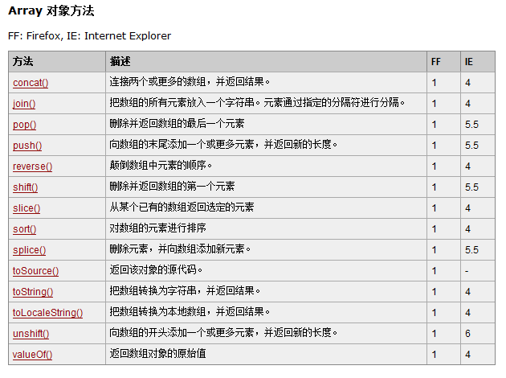

# 大纲 #
1. 作用域
2. 数组
3. 字符串

# 课程内容 #


## 作用域 ##


### 函数能封闭住定义域 ###


一个变量如果定义在了一个function里面，那么这个变量就是一个局部变量，只在这个function里面有定义。出了这个function，就如同没有定义过一样

### 作用域链 ###


当遇见一个变量时，JS引擎会从其所在的作用域依次向外层查找，查找会在找到第一个匹配的标识符的时候停止。


### 不写var就自动成全局变量了 ###


这是JS的一个机理，如果遇见了一个标识符，从来没有var过，并且还赋值了：那么就会自动帮你在全局范围内定义

### 函数的参数，会默认定义为这个函数的局部变量 ###

### 闭包 ###


## 数组 ##


计算长沙市的平均薪资？


长沙市平均月薪为3907元。
约为764万人


## 数组定义 ##

数组： 一组(一般情况下相同类型)的数据。


### 下标 ###
// 访问数组中的元素，通过 [] 来访问
// [] 写的是表达式，通过表达式的值来找到数组中的元素
// 称为【下标】


假如你定的酒店房间是 101， 
你们同行的朋友房间是相邻的，
总共有6间房

第一间房子： 101 + 0 ==> 101
第二间房子： 101 + 1 ==> 102
第二间房子： 101 + 2 ==> 102


arr[0] 等价于 在 arr + 0


加减的量称为偏移


### 静态赋值/动态赋值 ###

// 数组的长度属性是可写的
yangjie.length = 1;

## 遍历数组 ##

### 数组的长度 ###

// 获取数组中所有元素个数的方法
// 读作： 数组 arr 的 长度
// alert(arr.length);

【练习】求一个数组中有六个数字，求这些数字的和
var arr=[24,26,22,24,25,29];


---------
求一个数组中六个数字的最大值
var arr=[24,26,22,24,25,29];


---------
求一个数组中六个数字的平均数
var arr=[24,26,22,24,25,29];


【案例】把1到1000之间所有的被3或被7整除的数字存到数组里，
然后求平均值。


### for-in ###
遍历集合，注意参数为下标

// 遍历 arr， i 就代表所有的下标
/// 通过下标得到具体的元素 arr[i]
// 快速枚举的方式
for (var i in arr) {
	document.write(arr[i] + ", ");
}


## 引用类型 ##

引用： 索引， 数组、对象
值： 1， 2


【示例】 通过函数修改数组中的值


### 数组的常见方法 ###



数组的属性和方法
https://developer.mozilla.org/zh-CN/docs/Web/JavaScript/Reference/Global_Objects/Array


## 字符串 ##

字符串的属性和方法
https://developer.mozilla.org/zh-CN/docs/Web/JavaScript/Reference/Global_Objects/String

### 字符串查找 ###

```

var s1 = "1ab23***abc123";

// 查找 s1 中是否包含 ab

// 返回：从前往后 找，第一个找到的下标
// var r = s1.indexOf("ab");

// 返回：从后往前 找，第一个找到的下标
var r = s1.lastIndexOf("ab");

// 如果找不到，返回 -1，否则返回相应的下标

alert(r);

```

### 字符串替换 (了解正则表达式) ###

```

var s1 = "abc";

// 把 b 替换成 #

var s2 = s1.replace("b", "#");


alert(s1);
alert(s2);
```

### 字符串分割 ###

### 字符串截取 ###


# 作业 #


第1题
编写函数repeat(char,n) 实现重复char字符串n次
比如repeat("★",6) 返回"★★★★★★"

---------
第2题 (选做)
在控制台输出图形
```
    *
   ***
  *****
 *******
*********

```

---------
第3题
编写函数rev(char) 实现将字符串char倒置
比如rev("spring") 返回"gnirps"


---------
第4题
将字符串"i come from beijing"倒置，即控制台输出"beijing from come i"
语句直接写在程序中，不需要用户输入

---------
第5题(选做)
编写函数rightchange(char,n) 实现字符串char循环右移n位。
比如rightchange("abcdefg",2) 返回"fgabcde"


---------
第6题(选做， 有难度！)
编写函数maxr(char) 返回字符串char中最长的连续重复字母
比如maxr("mmmiijjjjkkkkkkssptr") 返回"kkkkkk"

---------
第7题
有10个学生的成绩存在数组中，请统计大于等于平均成绩的人数。
成绩直接以数组形式写在程序中，不需要用户输入。

---------
第8题
有10个学生的成绩存在数组中，请统计最高分，最低分，并将最高分和最低分学生的下标输出到控制台

---------
第9题
勾股定理：直角三角形中，两个直角边的平方和，等于斜边平方和。寻找三边的长度都不大于100，并且三边边长都是整数的可能，在控制台输出。

---------
第10题  这题非常难，别跳楼
编写函数maxsame(char1,char2) 返回字符串char1和char2的最大相同子串
比如maxsame("abcdefghijklmn","mndefghlm") 返回"defgh"

--------- 
第11题
将"i love javascript cai guai"的每个单词的第一个字母，变为大写。

答案：
```
var arr = "i love javascript cai guai".split(" ");
for(var i = 0 ; i < arr.length ; i++){
    arr[i] = arr[i].charAt(0).toUpperCase() + arr[i].substr(1);
}
arr.join(" ");

```

