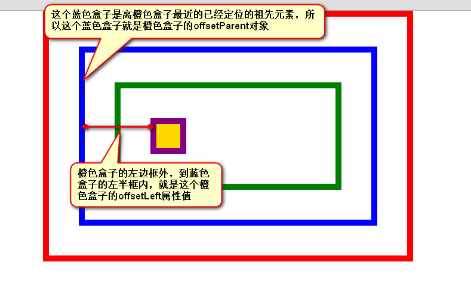

# 大纲 #

1. 快捷位置和尺寸
2. 运动
3. 无缝滚动


# 课堂内容 #

## 快捷位置和尺寸 ##

### offsetLeft属性和offsetTop属性 ###

这两个属性的兼容性非常差，不要着急，我们慢慢来看。

IE9、IE9+、Chrome等高级浏览器：

一个元素的offsetLeft值，就是这个元素左边框外，到自己的offsetParent对象的左边框内的距离。





每一个元素，天生都有一个属性，叫做offsetParent，表示自己的“偏移参考盒子”，我们不称呼中文，就叫offsetParent。这个offsetParent是谁呢？
就是自己祖先元素中，离自己最近的已经定位的元素，如果自己的祖先元素中，没有任何盒子进行了定位，那么offsetParent对象就是body。


【兼容代码】 参考笔记


### offsetWidth和offsetHeight ###

全线兼容，是自己的属性，和别的盒子无关。
一个盒子的offsetWidth值就是自己的 width+左右padding+左右border的宽度


### clientWidth和clientHeight ###
client表示“客户端”这里就是一个名字而已，不用在意这个名字。
clientWidth就是自己的width+padding的值。 也就是说，比offsetWidth少了border。

如果盒子没有宽度，那么那么所有浏览器都将把px值当做clientWidth，而不是100%
如果盒子没有高度，用文字撑的，IE6 clientHeight是0，其他浏览器都是数值。

总结一下，我们的6个属性要铭记于心，就offsetLeft、offsetTop比较闹腾，但是合理使用，也没兼容问题了。
 


## 运动 ##

### 运动模型 ###

定时器
setInterval  clearInterval
window对象有一个方法，叫做
```
	window.setInterval(函数，间隔时间);
```

能够使每间隔时间，调用函数一次。我们习惯叫做定时器，按理说叫做“间隔器”。


### 简单的运动 ###
视觉暂留：把连续相关的画面，连续播放，就是运动了。


那么现在我们来研究一个事儿，如果让这个盒子跑得更快？


### 定时器的停止 ###

setInterval的时候，要给这个定时器一个变量引用，停止的时候只需要clearInterval(timer)


### 运动框架 ###


为什么要封装一个运动框架呢？因为你不知道运动的复杂。


## 无缝滚动 ##


