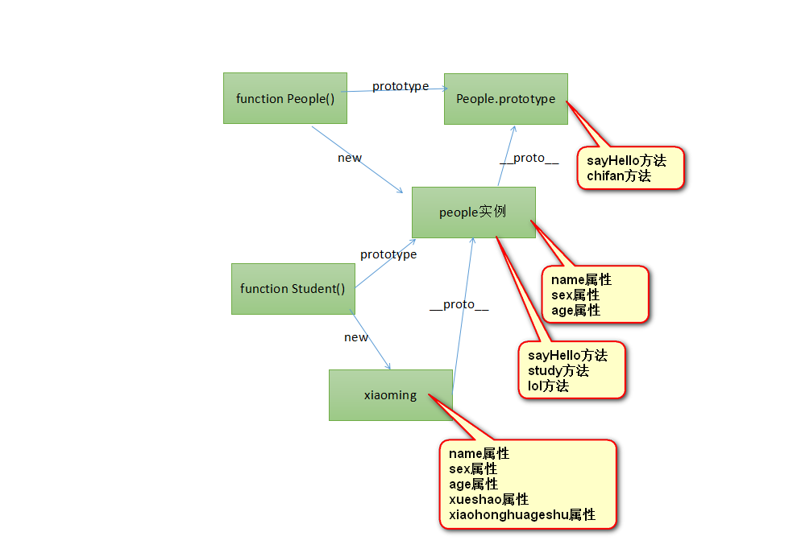

# 大纲 #

1. 原型
2. 继承
3. 案例


# 课堂内容 #

## 原型 ##

在JavaScript中，任何一个函数，都有一个prototype属性，指向一个对象。我们输出了一个函数的prototype属性，你会发现是一个空对象。输出这个prototype的类型，发现是object类型。
prototype就是英语“原型”的意思。每个函数都有原型，原型是一个对象。
一个函数的原型，对于普通函数来说，没任何鸟用。但是如果函数是一个构造函数，那么函数的原型，用处极大！
```
1	//构造函数，构造函数里面没有任何语句，也就是说，这个构造函数在执行的时候，不会给创建出来的对象添加任何属性。
2	function People(){
3	
4	}
5	//构造函数的原型，我们更改了构造函数的原型，为一个新的对象：
6	People.prototype = {
7		name : "考拉",
8		sex : "男",
9		age : 18
10	}
11	
12	//当一个对象被new出来的时候，不仅仅执行了构造函数里面的语句，也会把这个函数的__proto__指向构造函数的prototype。
13	var xiaoming = new People();
14	
15	console.log(xiaoming.__proto__);
16	console.log(xiaoming.__proto__ == People.prototype);
17	
18	//当我们试图访问name、sex、age属性的时候，身上没有。那么就去查找原型，原型身上有，就当做了自己的属性返回了。
19	console.log(xiaoming.name);
20	console.log(xiaoming.sex);
21	console.log(xiaoming.age);

```


prototype一定是函数的属性！当这个函数是一个构造函数的时候，那么它new出来的对象，将以它的原型那个对象为new出来的实例的原型对象。

注意，任何一个对象，都有__proto__属性，这个属性是Chrome自己的属性，别的浏览器不兼容，但是别的浏览器也有原型对象，只不过不能通过__proto__进行访问而已。
这是属性指向自己的原型对象。
我们的JavaScript有一个非常牛逼的机制：原型链查找。
当我们试图访问一个对象身上的属性的时候，如果这个对象身上有这个属性，则返回它的值。如果它身上没有这个属性，那么将访问它的原型对象，检测它的原型对象身上是否有这个值，如果有返回它原型对象身上的这个值。

也就是说，我们刚才讲解了2个对象和一个函数的故事。任何一个函数都有原型，原型是一个对象，用prototype来访问。当这个函数是构造函数的时候，new出来的对象，它们的原型对象就是这个构造函数的原型。
prototype我们称为“原型”，只有函数有原型
__proto__我们称为“原型对象”，任何对象都有原型对象。

### JavaScript原型链机制 ###

图解JavaScript原型链 
http://blog.rainy.im/2015/07/20/prototype-chain-in-js/


## 继承 ##

JavaScript继承方式详解
https://segmentfault.com/a/1190000002440502

JavaScript中的类继承
http://javascript.crockford.com/zh/inheritance.html

深入理解JavaScript面向对象和原型继承
https://github.com/norfish/blog/wiki/%E6%B7%B1%E5%85%A5%E7%90%86%E8%A7%A3JavaScrip%E9%9D%A2%E5%90%91%E5%AF%B9%E8%B1%A1%E5%92%8C%E5%8E%9F%E5%9E%8B%E7%BB%A7%E6%89%BF

```

“人”类 ， “小学生”类。 小学生也是人，只不过“丰富了”人。
“人”类有的属性，“小学生”都有，比如姓名、年龄、性别。
“人”类有的方法，“小学生”都有，比如打招呼、吃饭、睡觉。
除此之外，
“小学生”还丰富了一些属性：学号、班级、小红花个数、是否少先队员
“小学生”还丰富了一些方法：学习、lol、上课

```


小学生类，继承了人类。一说继承，千万不要想到人生的遗产继承，感觉小学生比人类少，是人类的局部。千万不要这么想。在计算机世界中，继承是“丰富”，是比原来的类要多东西。
小学生继承于人类， 小学生更丰富。

说白了，People、Student两个类，Student类的实例，拥有 People的全部属性属性、方法。
现在，你就应该朦朦胧胧的感觉到，用原型链来实现。JavaScript中没有extends。
People叫做父类、超类； Student叫做子类。


```
 function People(name,age,sex){
2				this.name = name;
3				this.age = age;
4				this.sex = sex;
5			}
6			People.prototype.sayHello = function(){
7				alert("你好我是人" + this.name);
8			}
9			People.prototype.chifan = function(){
10				alert("我吃饭了！mia mia");
11			}
12	
13	
14			function Student(name,age,sex,xuehao,xiaohonghuageshu){
15				this.name = name;
16				this.age = age;
17				this.sex = sex;
18				this.xuehao = xuehao;
19				this.xiaohonghuageshu = xiaohonghuageshu;
20			}
21			//核心语句，继承的实现全靠这条语句了：
22			Student.prototype = new People();
23			
24			Student.prototype.sayHello = function(){
25				alert("你好我是小学生，我的学号是" + this.xuehao);
26			}
27			Student.prototype.study = function(){
28				alert("好好学习，天天向上");
29			}
30			Student.prototype.lol = function(){
31				alert("玩儿英雄联盟啊！");
32			}
33	
34			var xiaohong = new Student("小红",11,"女",20160001,4);
35			//xiaohong.lol();
36			//xiaohong.chifan();
37			xiaohong.sayHello();

```



###  in运算符 ###

返回一个布尔值，表示这个属性是不是对象的属性。
```
1			var obj = {
2				a : 1,
3				b : 2,
4				c : false
5			}
6	
7			console.log("a" in obj);	//true
8			console.log("b" in obj);	//true
9			console.log("c" in obj);	//true
10			console.log("d" in obj);	//false

```

in不仅仅检测是对象自己有没有这个属性，如果原型链上有这个属性，那么也会返回true。整个原型链如果没有这个属性，就返回false。也就是说，in操作符会进行原型链查找。

for in 这个循环，会把原型链上所有的可枚举的属性列出来：
```
1	for(var k in obj){
2		console.log(k);
3	}

```

什么是可枚举，系统默认的属性（比如constructor）都是不可枚举的。for in循环能够把自己添加的属性罗列出来，罗列的不仅仅是自己身上的属性，还有原型链上的所有属性。

### hasOwnProperty方法 ###

这个方法定义在了Object.prototype对象上面，所以任何一个Object都能够拥有这个方法。
这个方法返回true、false。表示自己是否拥有这个属性，不考虑原型链。就看自己身上有没有这个属性，不进行原型链查找。
```
1			var obj = {
2				a : 1,
3				b : 2,
4				c : 3
5			}
6			obj.__proto__ = {
7				d : 4
8			}

9			console.log(obj.hasOwnProperty("a")); //t
10			console.log(obj.hasOwnProperty("b")); //t
11			console.log(obj.hasOwnProperty("c")); //t
12			console.log(obj.hasOwnProperty("d")); //f

```

for……in考虑原型链，所以我们可以内嵌一个判断，把自己身上的属性输出：
```
1	for(var k in obj){
2		obj.hasOwnProperty(k) && console.log(k);
3	}

```
 
### 对象直接打点验证某个属性是否存在 ###
对象打点调用属性，我们之前的课程已经讲过，遍历原型链。所以就可以看出来属性是否在自己身上、原型链上。如果在，就返回值；如果不在就返回undefined.


### instanceof运算符 ###

类在英语里面叫做class，实例在英语里面叫做instance。
instaceof运算符：
1	A instaceof B
验证A对象是不是B类的实例。


```

1			//类，构造函数
2			function Dog(){
3	
4			}
5			//实例化一个对象
6			var d = new Dog();
7			//验证d是不是Dog的一个实例
8			console.log(d instanceof Dog);

```

结果为 true

instanceof 运算符的机理： 遍访hellokitty这个对象的原型链上的每个原型对象，如果遍访到这个原型对象，是某个构造函数的prototype，那么就认为hellokitty是这个构造函数的实例，返回true。


用instanceof运算符能够轻松解决数组的识别：
```
1	var arr = [];
2	console.log(arr instanceof Array);

```

## 案例 ##


### 拖拽 ###
案例


## 作业 ##

1. 重写萤火虫与拖拽案例
